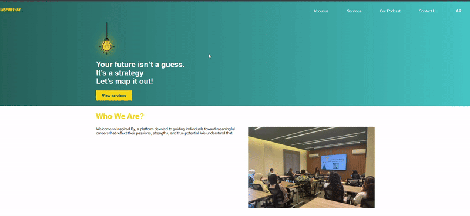

# Inspiredby-website

Overview
## A fully functional Inspired By project built with React, demonstrating how a service-focused company can effectively present its competency-based methodology, engage both individuals and organizations, and guide users through an empowering digital experience. 

This project was created alongside a YouTube series that walks through building custom hooks, routes, and reusable structures.
Every part of this project includes sample code showing how to: 

* Build a modern, responsive frontend using React and Vite 
* Architect a scalable folder structure with reusable UI components 
* Present structured service data and methodology steps using dynamic React components
* Validate and handle form submissions through API or email services 
* Implement client-side routing with React Router for smooth navigation
* Improve performance through code splitting, image optimization, and caching  

## Demo : 

## Tech Stack
* * Frontend 
- React 18
- Vite
- React Router 

* * Development Tools :  
- ESLint
- npm

## Features

- Responsive design for all devices
- Dynamic service presentation with competency-based methodology
- Client-side routing with React Router
- Reusable component architecture
- Form validation and submission handling
- Custom React hooks for enhanced functionality
- Backend integration (coming soon)
- Service image gallery (coming soon)

 ## Project Structure 
 ├── src/
 │   ├── assets/         # images and global css
 │   ├── components/     # Reusable UI components
 │   ├── pages/          # Page components
 │   ├── styles/         # Customized css
 │   ├── utils/          #Functions 
 │   └── App.jsx
 ├── public/
 ├── tests/              # Component Testing
 ├── docs/               
 └── README.md 

## Installation 

### Prerequisites
- Node.js(v18 or higher )
- npm (v9 or higher )

### Steps
git clone https://github.com/Danahterek888/Inspiredby-website
1. Navigate to the project folder 
cd inspiredby-website
2. Install Dependencies 
npm install 
3. Run the development server 
 npm run dev
4. Open your browser and visit 
http://localhost:5173

## Customizing the Project

Since this is an example project, feel free to clone and rename it for your own use. It works well as a starter boilerplate.

1. Clone the repository

2. Create your own branch

3. Install dependencies

4. Run the project

## Found a bug? 
If you encouter any bugs or issues: 
- Github Issues : [Create your issue here ](https://github.com/inspiredby-website/issues)
- Email :podcastinspiredby@outlook.com 
- Slack/Team : Contact @InspiredBy team 

Please include : 
- Description of the bug 
- Steps to reproduce 
- Screenshots (if applicable )
- Browser / device information 

## Known issues (Work in progress)

This tutorial and project are still in progress.
Current limitations:

* Service images are not yet displayed

* Backend server is not connected

More updates coming soon!